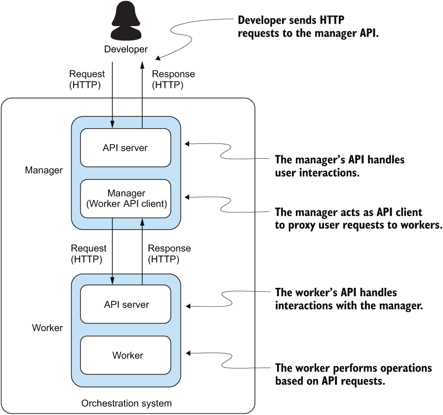

In manager:
    - API: user interaction with the ochestration system 
        - GET /api/v1/tasks     // Gets a list of all tasks
        - POST /api/v1/tasks    // Creates a task
        - DELETE /api/v1/tasks/{task_id}    // Stop the task identified by task_id
    - Task Database: the manager maintains the states of all tasks in the system in a database.
    - Event Database: the manager maintains the states of all events (i.e., task.TaskEvent).
    - Task Queue: the manager maintains a queue of tasks that are waiting to be executed.
    - Workers: the manager keeps track of workers that are available to execute tasks.