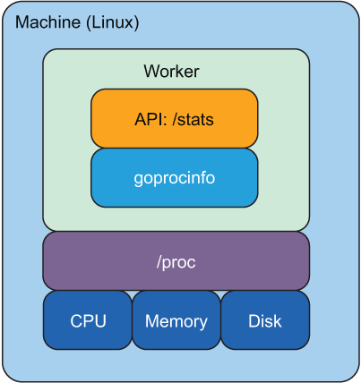
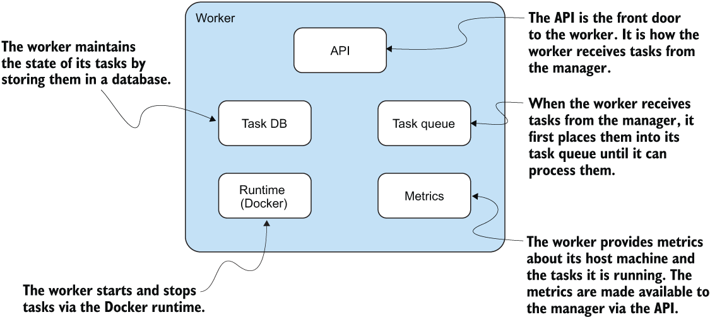
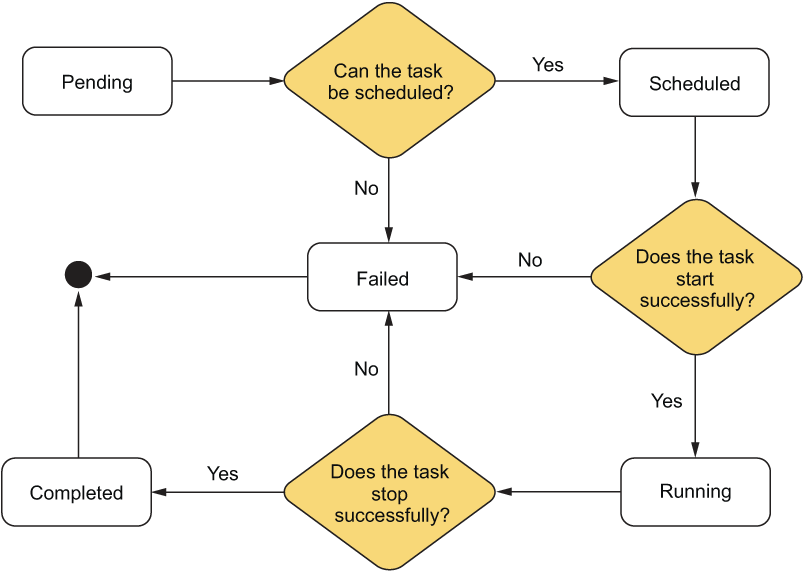

In worker:
- API: worker receives tasks from the manager
- (Docker) Runtime: worker starts and stops tasks
- Task Database: maintains the state of tasks in the worker
- Task Queue: when worker receives tasks from the manager, it first adds them to the queue until it is ready to process them.
- Metrics: worker collects metrics from the tasks it runs and sends them to the manager. 

